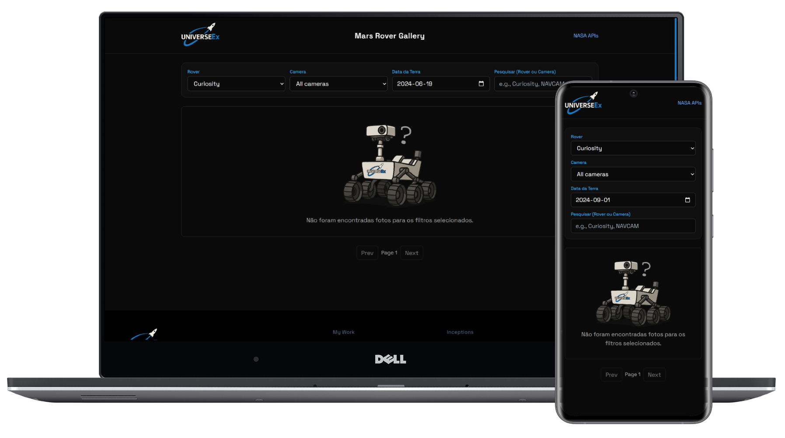

<style>
   img[alt="UniverseEx Logo"] {
      max-width: 400px;
      display: block;
      margin: 0 auto 20px;
   }
</style>

Bem-vindo ao **UniverseEx**, um projeto de Front-End desenvolvido como parte de um desafio técnico.
O objetivo é construir uma aplicação moderna onde usuários podem **visualizar, buscar e filtrar imagens de Marte** capturadas pelos Rovers da NASA.

## 🌌 Contexto

A UniverseEx é uma empresa fictícia focada em exploração espacial.
Nosso desafio foi criar uma plataforma intuitiva que permita ao usuário:

* Acessar imagens reais da NASA (Mars Rover Photos API).
* Visualizar detalhes de cada foto (data terrestre, câmera utilizada, Rover responsável).
* Buscar e filtrar imagens por diferentes critérios.
* Navegar de forma paginada para explorar o acervo completo.

Esse projeto combina **tecnologia de ponta (Next.js 15)** com boas práticas de **desenvolvimento front-end**, acessibilidade e usabilidade.

---

## ⚙️ Funcionalidades

* **Galeria dinâmica de imagens** diretamente da [API da NASA](https://api.nasa.gov/#mars-rover-photos).
* **Busca avançada** por nome do Rover ou câmera.
* **Filtros customizáveis** para refinar os resultados:
   * Rover específico
   * Câmera(s) utilizadas
   * Data da foto (terrestre)

* **Paginação** para navegação entre conjuntos de fotos.
* Layout completo com:
   * **Header**
   * **Seção de conteúdo** (galeria + filtros)
   * **Footer**
* Estilo moderno e responsivo, otimizado para diferentes tamanhos de tela.

---

## 🛠️ Tecnologias utilizadas

* **Next.js 15** – framework principal para renderização e rotas.
* **React** – para construção dos componentes reutilizáveis.
* **TailwindCSS** – estilização moderna, responsiva e eficiente.
* **TypeScript** – tipagem estática e maior robustez no código.
* **API da NASA** – fonte de dados em tempo real (Mars Rover Photos).
* **PhotoShop** – edição e otimização de imagens.

---

## 📸 Preview




<style>
   img[alt="Preview da Aplicação"],
   img[alt="Mockup em celular"] {
      max-width: 90%;
      display: block;
      margin: 20px auto;
      border-radius: 8px;
      box-shadow: 0 4px 12px rgba(0, 0, 0, 0.1);
   }
</style>
---

## 👨‍🚀 Autor

Desenvolvido por **Daran Soares**
📧 \[[daran02soares02@gmail.com](mailto:daran02soares02@gmail.com)]
🔗 [LinkedIn](https://www.linkedin.com/in/daran-soares/) | [GitHub](https://github.com/MultMan02)

---

## 📂 Estrutura do Projeto

```bash
UniverseEx/
│── public/          # Assets estáticos (ícones, imagens, etc.)
│── src/
│   ├── components/  # Componentes reutilizáveis (Header, Footer, Card, etc.)
│   ├── pages/       # Estrutura de rotas Next.js
│   ├── services/    # Configuração da API da NASA
│   ├── styles/      # Estilos globais
│   └── utils/       # Funções auxiliares
│── package.json     # Dependências e scripts
│── README.md        # Documentação do projeto
```

---

## 🚀 Como rodar o projeto localmente

### 1️⃣ Clonar o repositório

```bash
git clone https://github.com/seu-usuario/UniverseEx.git
cd UniverseEx
```

### 2️⃣ Instalar dependências

```bash
npm install
# ou
yarn install
```

### 3️⃣ Configurar variáveis de ambiente

Crie um arquivo `.env.local` na raiz do projeto com a sua chave da NASA:

```env
NEXT_PUBLIC_NASA_API_KEY=coloque_sua_chave_aqui
```

> 🔑 Você pode gerar a chave gratuitamente em: [https://api.nasa.gov](https://api.nasa.gov)

### 4️⃣ Rodar em modo de desenvolvimento

```bash
npm run dev
```

Abra no navegador: **[http://localhost:3000](http://localhost:3000)**

---

## 🎨 Diferenciais do Projeto

✨ Interface moderna, limpa e responsiva.

✨ Utilização de boas práticas de código e organização modular.

✨ Documentação clara para facilitar manutenção e escalabilidade.

✨ Experiência do usuário em primeiro lugar: busca eficiente, filtros intuitivos e carregamento rápido.

---

## 📜 Licença

Este projeto foi desenvolvido exclusivamente para fins de avaliação técnica.
Todos os dados e imagens são fornecidos pela NASA através da **Mars Rover Photos API**.